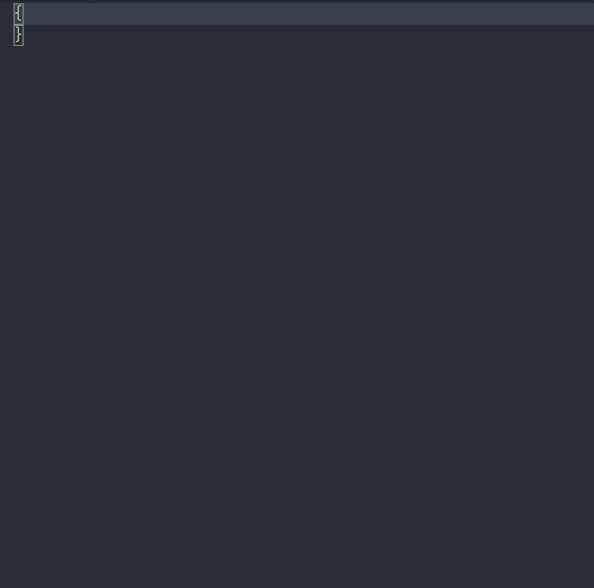

# Looking for co-maintainer

I have switched to use other proxy solutions so there is lesser motivation for me to maintain this generator and schemas.
Please contact me (via [Issues](https://github.com/EHfive/v2ray-jsonschema/issues) or email) if you have enough motivation to keep this project running. There is no requirement on understanding the code of this project but some basic understanding of Go and JSON schema are hoped. I would then add documentations on how the generator works and maintenance instructions.

---

# V2Ray JSON Schema

Build JSON schemas of [V2Ray](https://github.com/v2fly/v2ray-core) v4, v5 json config format through Go type reflection system.

[简体中文](./README_zh-CN.md)

## Usage

#### Specify the schema in-place

Set property `$schema` to URL of corresponding format of JSON schema in V2Ray config file. You will then get auto suggestions from some IDEs while editing V2Ray config file.

VSCode is known to support this syntax, see [doc](https://code.visualstudio.com/docs/languages/json#_json-schemas-and-settings).

#### Schemas

- jsonv4 schema (GitHub): https://github.com/EHfive/v2ray-jsonschema/raw/main/v4-config.schema.json
- jsonv5 schema (GitHub): https://github.com/EHfive/v2ray-jsonschema/raw/main/v5-config.schema.json

- jsonv4 schema (jsDelivr CDN): https://cdn.jsdelivr.net/gh/EHfive/v2ray-jsonschema/v4-config.schema.json
- jsonv5 schema (jsDelivr CDN): https://cdn.jsdelivr.net/gh/EHfive/v2ray-jsonschema/v5-config.schema.json

#### Example Config

```json
{
  "$schema": "https://github.com/EHfive/v2ray-jsonschema/raw/main/v5-config.schema.json",
  "inbounds": [
    {
      "protocol": "socks",
      "listen": "127.0.0.1",
      "port": 1080
    }
  ],
  "outbounds": [
    {
      "protocol": "freedom"
    }
  ]
}
```

#### Autosuggestion Demo



### Caution

Due to custom JSON, protobuf (un)marshaling used on config types, not all types are getting mapped to JSON schemas in a generic mapping process. Although some most important ones have been manually re-mapped, there are still some unmapped types left in generated schemas.

## jsonschema

This project uses a modified version of [jsonschema](https://github.com/invopop/jsonschema) to generate schemas.
